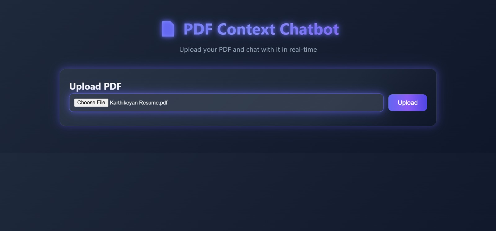
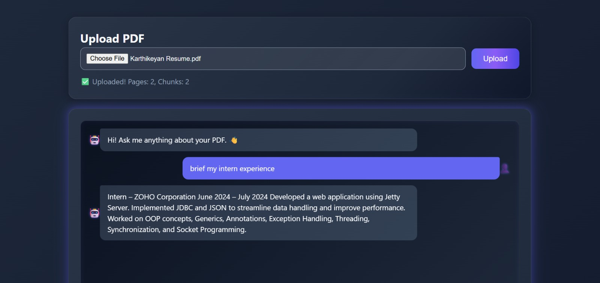
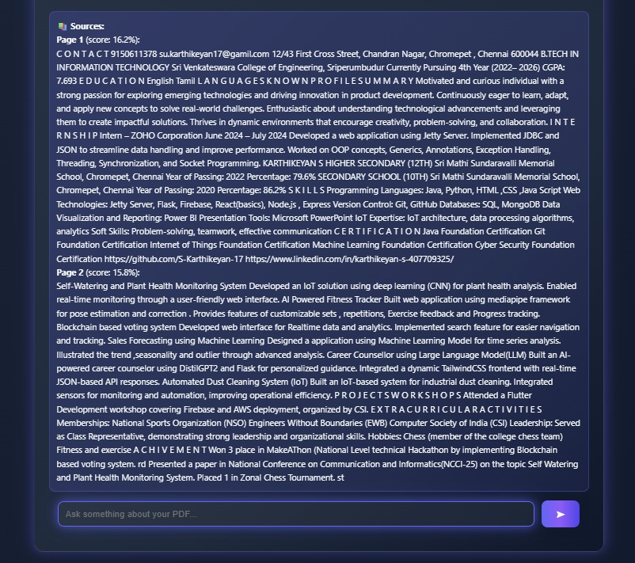

# AI-Powered PDF Context Retrieval Chatbot (RAG)

This repository implements **Project B** from the AI Engineer – Round 2 Assignment: an AI-powered chatbot for querying PDF documents using Retrieval-Augmented Generation (RAG). The system allows uploading PDFs, extracts and chunks text, indexes embeddings in ChromaDB for semantic search, retrieves relevant contexts, and generates answers using Google's Gemini LLM, with source references (pages and scores).

The backend uses FastAPI for API endpoints, with a static frontend for user interaction. It ensures modular code, configuration via `.env`, and no hardcoded secrets.





## 📌 Features
- **PDF Ingestion & Chunking**: Extracts text with PyMuPDF, splits into overlapping chunks based on token limits, and indexes in ChromaDB using Sentence Transformers embeddings.
- **Semantic Retrieval**: Queries ChromaDB for top-k relevant chunks using cosine similarity, returning contexts with page numbers and scores.
- **RAG with LLM**: Builds prompts from retrieved contexts and calls Gemini API to generate accurate, context-bound answers (fallback to raw contexts if API key missing).
- **Frontend Interface**: Multi-step UI for PDF upload and querying, displaying answers and sources.
- **API Endpoints**: Upload PDFs, query documents, and health checks with Pydantic validation and error handling.
- **Configuration & Persistence**: Customizable via `.env` (e.g., chunk sizes, top-k); persistent storage for uploads and vector DB.

## 🏗️ Tech Stack
- **Backend**: FastAPI, Uvicorn
- **PDF Processing**: PyMuPDF (fitz)
- **Embeddings & Vector DB**: Sentence Transformers, ChromaDB
- **LLM Integration**: Google Generative AI (Gemini API)
- **Frontend**: HTML, JavaScript, CSS
- **Other**: Pydantic, Requests, UUID, Re

## 📂 Project Structure
```
rag-pdf-chatbot/
├── .git/                     # Git repository files
├── .venv/                    # Virtual environment (not committed)
├── __pycache__/              # Python cache
├── output_screenshot/        # Screenshots of the application
│   ├── output1.png  # PDF upload form
│   ├── output2.png     # Chat query and response
│   └── output3.png         # API response example
├── static/                   # Static frontend files
│   ├── index.html            # Main UI page
│   ├── script.js             # JavaScript for upload and query logic
│   └── style.css             # CSS styling
├── storage/                  # Persistent storage (created on run)
│   ├── chroma/               # ChromaDB vector store
│   └── uploads/              # Uploaded PDF files
├── .env                      # Configuration (API keys, etc.; not committed)
├── .gitignore                # Git ignore file
├── app.py                    # FastAPI backend (ingestion, retrieval, RAG)
├── README.md                 # This documentation
├── requirements.txt          # Python dependencies
└── test_gemini.py            # Script to test Gemini API key
```

## ⚙️ Setup Instructions
1. **Clone the Repository**:
   ```
   git clone https://github.com/S-Karthikeyan-17/rag-pdf-chatbot.git
   cd rag-pdf-chatbot
   ```

2. **Create and Activate Virtual Environment** (recommended):
   ```
   python -m venv .venv
   source .venv/bin/activate  # On Linux/Mac
   .\.venv\Scripts\activate   # On Windows
   ```

3. **Install Dependencies**:
   ```
   pip install -r requirements.txt
   ```

4. **Configure Environment**:
   - Create `.env` from the sample in the repo and add your Gemini API key:
     ```
     GEMINI_API_KEY=your_gemini_api_key_here
     ```
   - Optional settings (defaults in code):
     ```
     GEMINI_MODEL=gemini-2.0-flash
     CHROMA_PERSIST_DIR=./storage/chroma
     UPLOAD_DIR=./storage/uploads
     EMBEDDING_MODEL=sentence-transformers/all-MiniLM-L6-v2
     CHUNK_SIZE_TOKENS=350
     CHUNK_OVERLAP_TOKENS=50
     TOP_K=5
     ```
   - Get Gemini key from [Google AI Studio](https://aistudio.google.com/).

## 🚀 How to Run
### Testing Gemini API
Verify your API key:
```
python test_gemini.py
```
- Expected output: Confirmation message from Gemini.

### Running the FastAPI Backend
Start the server:
```
uvicorn app:app --reload --port 8000
```
- API at `http://127.0.0.1:8000`.
- Frontend at `http://127.0.0.1:8000/` (browser-based UI for upload and chat).

### Retraining/Regenerating Artifacts
- No traditional ML training (pre-trained embeddings/LLM). Artifacts are ChromaDB indices and uploads.
- To regenerate:
  - Update `.env` (e.g., change `EMBEDDING_MODEL` or chunk sizes).
  - Delete `./storage/chroma` and `./storage/uploads`.
  - Re-upload PDFs via API/UI to reindex.
- For LLM changes: Update `GEMINI_MODEL` in `.env` and restart server.

## 🔗 API Usage
Use Postman/cURL or frontend. Swagger docs at `http://127.0.0.1:8000/docs`.

### 1. Health Check
- **Method**: GET
- **Endpoint**: `/health`
- **Response Example**:
  ```json
  {"status": "ok"}
  ```

### 2. Upload Document
- **Method**: POST
- **Endpoint**: `/documents`
- **Request**: Multipart form with `file` (PDF).
- **cURL Example**:
  ```
  curl -X POST "http://127.0.0.1:8000/documents" -F "file=@/path/to/file.pdf"
  ```
- **Response Example**:
  ```json
  {
    "doc_id": "abc123",
    "pages": 5,
    "chunks": 20
  }
  ```

### 3. Query Document
- **Method**: POST
- **Endpoint**: `/query`
- **Request Body** (JSON):
  ```json
  {
    "doc_id": "abc123",
    "question": "What is the objective?",
    "top_k": 5
  }
  ```
- **cURL Example**:
  ```
  curl -X POST "http://127.0.0.1:8000/query" -H "Content-Type: application/json" -d '{"doc_id": "abc123", "question": "What is the objective?", "top_k": 5}'
  ```
- **Response Example**:
  ```json
  {
    "answer": "The objective is to build an end-to-end system...",
    "contexts": [
      {"page": 1, "text": "Excerpt...", "score": 0.95},
      ...
    ]
  }
  ```
- **Error Handling**: 400/404 with details (e.g., invalid doc_id).

## 📊 Dataset Insights
No fixed dataset (arbitrary PDFs). Key patterns in processing:
- **Chunking Trends**: Paragraph-based splitting with overlap ensures context preservation; average chunk size ~350 tokens for balance.
- **Retrieval Patterns**: High scores (>0.8) for exact matches; lower for semantic. Pages with dense text (e.g., objectives) retrieved more.
- **High-Impact Factors**: Query relevance drives scores; overlap reduces info loss.

For custom PDFs, insights depend on content—e.g., in assignment PDF, high retrieval on "Objective" sections.

## 📈 Visualizations & Reports
No generated plots (runtime system). Screenshots in `output_screenshot/`:
- `upload_interface.png`: Upload form and status.
- `chat_response.png`: Query, answer, and sources.
- `api_query.png`: JSON response in tool.

Reports: Console logs during run; no notebooks (no EDA/training needed, logic in modules).

## 🛠️ Future Enhancements
- Support multi-document queries.
- Add OCR for scanned PDFs.
- Integrate other LLMs (e.g., Grok API).
- Dockerize for deployment.

## 👨‍💻 Author
Karthikeyan S  
GitHub: S-Karthikeyan-17  

## GitHub Links
- https://github.com/S-Karthikeyan-17/rag-pdf-chatbot](https://github.com/S-Karthikeyan-17/rag-pdf-chat
